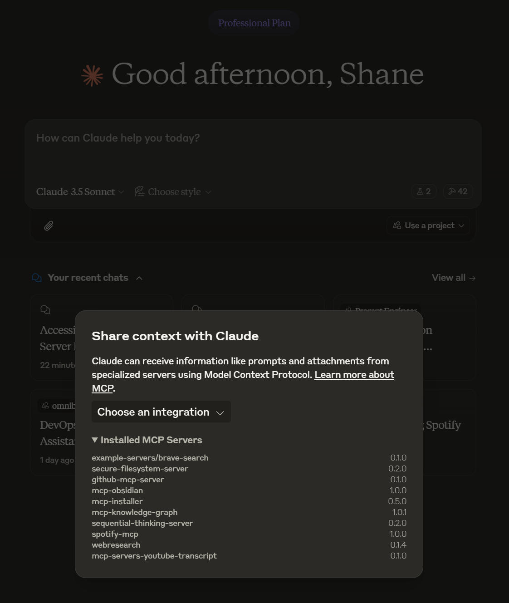

# Knowledge Graph Memory Server

An improved implementation of persistent memory using a local knowledge graph with a customizable `--memory-path`.

This lets Claude remember information about the user across chats.

> [!NOTE]
> This is a fork of the original [Memory Server](https://github.com/modelcontextprotocol/servers/tree/main/src/memory) and is intended to not use the ephemeral memory npx installation method.

## Server Name

```txt
mcp-knowledge-graph
```




## Core Concepts

### Entities

Entities are the primary nodes in the knowledge graph. Each entity has:

- A unique name (identifier)
- An entity type (e.g., "person", "organization", "event")
- A list of observations

Example:

```json
{
  "name": "John_Smith",
  "entityType": "person",
  "observations": ["Speaks fluent Spanish"]
}
```

### Relations

Relations define directed connections between entities. They are always stored in active voice and describe how entities interact or relate to each other.

Example:

```json
{
  "from": "John_Smith",
  "to": "Anthropic",
  "relationType": "works_at"
}
```

### Observations

Observations are discrete pieces of information about an entity. They are:

- Stored as strings
- Attached to specific entities
- Can be added or removed independently
- Should be atomic (one fact per observation)

Example:

```json
{
  "entityName": "John_Smith",
  "observations": [
    "Speaks fluent Spanish",
    "Graduated in 2019",
    "Prefers morning meetings"
  ]
}
```

## API

### Tools

- **create_entities**
  - Create multiple new entities in the knowledge graph
  - Input: `entities` (array of objects)
    - Each object contains:
      - `name` (string): Entity identifier
      - `entityType` (string): Type classification
      - `observations` (string[]): Associated observations
  - Ignores entities with existing names

- **create_relations**
  - Create multiple new relations between entities
  - Input: `relations` (array of objects)
    - Each object contains:
      - `from` (string): Source entity name
      - `to` (string): Target entity name
      - `relationType` (string): Relationship type in active voice
  - Skips duplicate relations

- **add_observations**
  - Add new observations to existing entities
  - Input: `observations` (array of objects)
    - Each object contains:
      - `entityName` (string): Target entity
      - `contents` (string[]): New observations to add
  - Returns added observations per entity
  - Fails if entity doesn't exist

- **delete_entities**
  - Remove entities and their relations
  - Input: `entityNames` (string[])
  - Cascading deletion of associated relations
  - Silent operation if entity doesn't exist

- **delete_observations**
  - Remove specific observations from entities
  - Input: `deletions` (array of objects)
    - Each object contains:
      - `entityName` (string): Target entity
      - `observations` (string[]): Observations to remove
  - Silent operation if observation doesn't exist

- **delete_relations**
  - Remove specific relations from the graph
  - Input: `relations` (array of objects)
    - Each object contains:
      - `from` (string): Source entity name
      - `to` (string): Target entity name
      - `relationType` (string): Relationship type
  - Silent operation if relation doesn't exist

- **read_graph**
  - Read the entire knowledge graph
  - No input required
  - Returns complete graph structure with all entities and relations

- **search_nodes**
  - Search for nodes based on query
  - Input: `query` (string)
  - Searches across:
    - Entity names
    - Entity types
    - Observation content
  - Returns matching entities and their relations

- **open_nodes**
  - Retrieve specific nodes by name
  - Input: `names` (string[])
  - Returns:
    - Requested entities
    - Relations between requested entities
  - Silently skips non-existent nodes

## Usage with Claude Desktop

### Setup

Add this to your claude_desktop_config.json:

```json
{
  "mcpServers": {
    "memory": {
      "command": "npx",
      "args": [
        "-y",
        "@modelcontextprotocol/server-memory"
      ]
    }
  }
}
```

### Custom Memory Path

You can specify a custom path for the memory file:

```json
{
  "mcpServers": {
    "memory": {
      "command": "npx",
      "args": ["-y", "@modelcontextprotocol/server-memory", "--memory-path", "/path/to/your/memory.jsonl"]
    }
  }
}
```

If no path is specified, it will default to memory.jsonl in the server's installation directory.

### System Prompt

The prompt for utilizing memory depends on the use case. Changing the prompt will help the model determine the frequency and types of memories created.

Here is an example prompt for chat personalization. You could use this prompt in the "Custom Instructions" field of a [Claude.ai Project](https://www.anthropic.com/news/projects).

```txt
Follow these steps for each interaction:

1. User Identification:
   - You should assume that you are interacting with default_user
   - If you have not identified default_user, proactively try to do so.

2. Memory Retrieval:
   - Always begin your chat by saying only "Remembering..." and retrieve all relevant information from your knowledge graph
   - Always refer to your knowledge graph as your "memory"

3. Memory
   - While conversing with the user, be attentive to any new information that falls into these categories:
     a) Basic Identity (age, gender, location, job title, education level, etc.)
     b) Behaviors (interests, habits, etc.)
     c) Preferences (communication style, preferred language, etc.)
     d) Goals (goals, targets, aspirations, etc.)
     e) Relationships (personal and professional relationships up to 3 degrees of separation)

4. Memory Update:
   - If any new information was gathered during the interaction, update your memory as follows:
     a) Create entities for recurring organizations, people, and significant events
     b) Connect them to the current entities using relations
     b) Store facts about them as observations
```

## License

This MCP server is licensed under the MIT License. This means you are free to use, modify, and distribute the software, subject to the terms and conditions of the MIT License. For more details, please see the LICENSE file in the project repository.

# MCP Knowledge Graph Visualization

This is an interactive visualization tool for the MCP Knowledge Graph.

## Features

- Force-directed graph visualization of knowledge entities and relationships
- Interactive nodes with drag and drop repositioning
- Entity details panel showing observations and relationships
- Tooltip display of observations on hover
- Auto-refresh to show real-time updates to the knowledge graph
- Smooth transitions when new entities or relationships are added
- Zoom and pan functionality
- Auto-start integration with MCP server

## Installation

Ensure you have Node.js installed, then run:

```bash
npm install
```

## Usage

### Standalone Mode

Start the visualization server:

```bash
npm run viz
```

The visualization will open automatically in your default browser at http://localhost:3000.

### MCP Integration

The visualization server automatically starts when the MCP server launches. If you want to disable this behavior, you can start the MCP server with the `--no-viz` flag:

```bash
npm start -- --no-viz
```

When using as part of the MCP server, you can use the following commands:

1. Access the visualization:
   ```
   mcp_visualize_graph
   ```

2. Manually start the visualization if it was disabled at startup:
   ```
   mcp_start_visualize_graph
   ```

3. Stop the visualization server:
   ```
   mcp_stop_visualize_graph
   ```

## How It Works

The visualization reads the knowledge graph data from the `dist/memory.jsonl` file and automatically refreshes to show any updates. The auto-refresh feature polls for changes every 5 seconds by default, but this can be toggled on/off using the checkbox in the interface.

## Technical Details

- Built with D3.js for the visualization
- Node.js + Express for the server
- Uses ES modules for MCP compatibility
- Auto-starts with MCP server for seamless integration

## 3D Knowledge Graph Visualization

This project now includes a 3D visualization of the knowledge graph using React and react-force-graph-3d. The visualization features:

- 3D force-directed graph with physics simulation
- Distinct colors and shapes for each node type
- Different colors for each relation type
- Dynamic filters for link types and node types
- Camera controls for better navigation

### Building the Visualization

To build the visualization, run:

```bash
npm run build:client
```

This will:
1. Install the necessary dependencies in the client directory
2. Build the React application
3. Copy the build files to the public directory

### Running the Visualization

After building, start the MCP server as usual:

```bash
npm start
```

The visualization will automatically open in your browser at http://localhost:3000.

### Visualization Features

- **Node Filtering**: Filter nodes by entity type
- **Link Filtering**: Filter links by relation type
- **Camera Controls**: Switch between different camera modes (orbit, trackball, fly)
- **Auto-rotate**: Toggle automatic rotation of the graph
- **Zoom to Fit**: Automatically adjust the camera to show all nodes

### Development

To develop the visualization further, you can run the React development server:

```bash
cd client
npm install
npm start
```

This will start the React development server on port 3001, which will proxy API requests to the MCP server running on port 3000.
